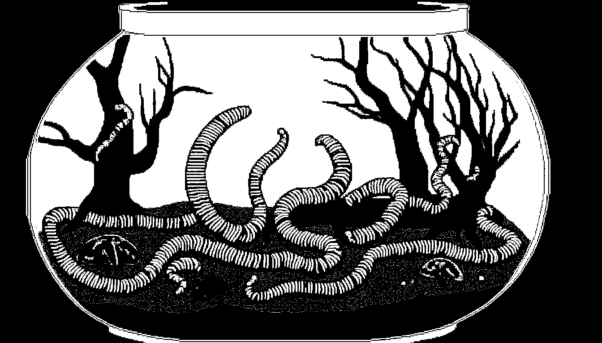
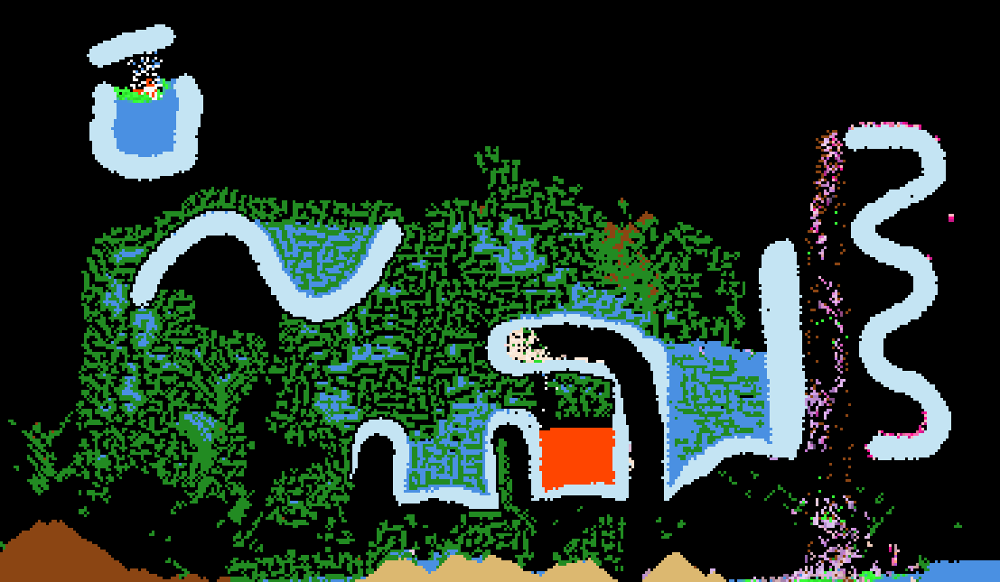

# pixelarium

real-time cellular automata with evolving creatures, procedural audio, and emergent ecosystems.

## overview

pixelarium simulates a world of falling sand physics where materials interact chemically, trees grow fractally toward water, and pink worms navigate using learned memory that passes to offspring through breeding.

[PLAY NOW](https://cursedhelm.com/games/pixelarium/)

## controls

- **click+drag** paint selected material
- **double-click** place persistent generator
- **spacebar** pause/resume
- **ctrl+v** paste image (dithered to material palette)



## material physics

### density-based movement

materials fall and displace based on relative density. heavier materials sink through lighter ones.

| material | density | behavior |
|----------|---------|----------|
| steam | 0.5 | rises, condenses on glass → water |
| fire | 1.0 | rises slightly, 60 frame lifespan |
| water | 2.0 | flows horizontally, falls fast (up to 3 cells/frame) |
| acid | 2.5 | floats on water, corrodes most materials |
| sand | 3.0 | sinks through water, melts to glass near fire/lava |
| dirt | 4.0 | sinks through water, sprouts trees when wet |
| lava | 4.0 | flows slowly, vaporizes water, ignites flammables |
| tree | 5.0 | static when connected, isolated pixels fall |
| glass | 8.0 | immovable barrier, condenses steam |

### chemical interactions

**fire**
- spreads to flammable materials (5% chance per neighbor)
- converts sand → glass (2%)
- converts water → steam (8%)
- burning plants release steam

**water**
- extinguishes adjacent fire (30%)
- touching dirt triggers tree growth (0.8%)
- consumed when trees grow

**acid**
- dissolves non-glass materials (3%)
- diluted by water majority → becomes tinted water
- life timer: 90 frames before evaporation

**lava**
- ignites flammables (10%)
- vaporizes water → steam (20%)
- melts sand → glass (5%)

**steam**
- condenses on glass → water (15%)
- 120 frame lifespan

## tree system

### fractal growth

trees grow from dirt+water contact. growth uses a queue-based branching algorithm:

1. dirt pixel touches water → converts to tree, water consumed
2. growth node spawns with direction, length, thickness
3. each frame: extend trunk upward with random sway
4. branch probability increases with thickness (20-50%)
5. branches spawn left/right with reduced length and thickness
6. glass blocks all growth paths

### lifecycle

- **connected trees** form stable structures (won't fall)
- **isolated pixels** (0 neighbors) fall like sand
- **death conditions**: isolated or end-branch without water access within 15 pixels
- **death rates**: 8% for isolated, 3% for end-branches
- **decomposition**: dead trees decay over 180 frames → dirt

### behavior

trees actively grow toward nearby water (8 pixel range). clustered trees (3+ neighbors) branch more aggressively. growth can push through dirt and into water (aquatic growth).

## worm intelligence

worms are 3-pixel creatures (head, body, tail) with individual memory, genetic colors, and goal-directed behavior.

### memory system

each worm maintains up to 32 memories. memories encode:

```
{
  relativeElevation: -3 to +3 (solids below vs above)
  localTreeDensity: 0-25 (trees in 5x5 area)
  localPixelClass: -4 to +4 (chemical environment score)
  movement: {dx, dy}
  weight: -5 to +5 (learned value)
  kind: 'food' | 'breed' | 'neutral'
}
```

**environmental scoring**
- tree/dirt/dead_tree: +2
- water: +1
- acid/fire/lava: -4

memories key on environmental context, not position. this allows generalization: a worm learning "go up when surrounded by trees" applies that knowledge anywhere.

### decision making

movement selection uses weighted scoring:

1. **food priority**: eating tree pixels always takes precedence
2. **social attraction**: bias toward nearby worms (breeding opportunities)
3. **cluster seeking**: navigate toward dense tree groups
4. **surface following**: prefer moves maintaining solid contact
5. **memory weighting**: past successes/failures in similar contexts
6. **goal alignment**: bonus for moves matching current navigation goal

worms sample local pixel class before moving, avoiding dangerous materials. when stuck, they reverse direction or cycle body positions.

### physics

- worms need solid surface contact to crawl (can't fly)
- unsupported worms fall
- worms displace water (water moves to where tail was)
- worms can push dirt/sand upward when climbing
- eating trees restores life (+1, capped at 120% max)

### damage and fire

- **acid contact**: -3 life per update
- **fire contact**: -5 life per update
- **lava contact**: -10 life per update
- **on fire status**: persists until water contact, -2 life per update
- fire/lava ignite worms; water extinguishes

### death

worms die when life reaches 0. corpses convert to acid (3 pixels), seeding the environment with corrosive material.

## breeding

### conditions

- both worms mature (25+ frames old)
- within 2 pixels of each other
- neither submerged (6+ water contacts, <3 air contacts)
- 8% base chance per eligible pair

### offspring

spawned near parents with inherited traits:

**memory inheritance**
- takes 8 strongest memories from each parent (by |weight|)
- interleaves and caps at 16 total
- 20% mutation chance per memory (weight ±1)

**color genetics**

colors blend based on memory influence:

```
parent1Influence = |p1MemorySum| / (|p1MemorySum| + |p2MemorySum| + 1)
```

brightness shifts based on inherited memory quality:
- positive memories → lighter offspring
- negative memories → darker offspring

hue tints based on memory type ratio:
- food-dominant memories → warmer (peachy-pink)
- breed-dominant memories → cooler (lilac-pink)

mutation chance scales with parent memory diversity difference (up to 30%).

### breeding cost

both parents lose 15 life. failed breeding attempts (no space) penalize recent memories.

## audio engine

### architecture

web audio api with:
- master gain → dynamics compressor (limiter) → destination
- per-material water noise system
- per-worm fm synthesis voices (max 16 polyphony)

### water noise

continuous noise generator responds to water simulation state:

**signal flow**
```
noise buffer → lowpass filter (material-tone modulated)
            → dual-band split (400hz rumble / 2.4khz hiss)
            → density crossfade
            → movement-modulated envelope
            → master
```

**modulation**
- filter cutoff tracks average material frequencies on grid
- falling water boosts cutoff (+800hz max)
- water density controls bass/treble balance
- movement creates transient volume bursts with 2s decay
- dual LFOs add subtle breathing texture

**splash accents**

material interactions trigger LFO modulation bursts:
- `steamHiss`: fire+water, water extinguishing
- `waterDrop`: dirt+water tree growth
- `acidFizz`: acid neutralization
- `lavaBloop`: lava vaporizing water

### worm voices

each worm gets a persistent dual-carrier fm synthesizer:

**architecture**
```
modulator → mod1Gain → carrier1.detune
          → mod2Gain → carrier2.detune

carrier1 → carrier1Gain → voiceGain → master (movement)
carrier2 → carrier2Gain →          → eventEnv → eventAmp → master (events)
```

base frequency varies by worm id (160-320hz range).

**movement sounds**
- triggered every 4th frame when worm moves
- carrier frequency tracks movement vector
- modulation rate tracks mood (memory weight average)
- modulation depth scales with mood (3-18hz)

**event sounds**

| event | characteristics |
|-------|-----------------|
| mating | dual carriers, cross-modulation, perfect fifth harmony, 80ms |
| eating | dual carriers, parallel modulation, lower frequencies, 120ms |
| dying | single carrier, slow attack, 400ms decay |
| material | single carrier, short blip (40ms) on new surface contact |

frequency follows lydian mode intervals based on mood:
```
intervals = [1, 9/8, 5/4, 11/8]
index = floor(|mood * 4|) % 4
```

### voice allocation

- max 16 simultaneous worm voices
- excess worms spawn silent (no oscillators)
- when voiced worms die, freed slots reallocate to oldest silent worm
- silent worms still function, just don't make sound

### pop prevention

all parameter changes use `cancelAndHoldAtTime` + short linear ramps (2-10ms) to avoid clicks. exponential ramps to 0.001 (not 0) prevent log domain errors.

## simulation loop

```
1. process generators (every 3 frames)
2. update worms (every 100ms, frame-rate independent)
   - check breeding (every 500ms)
   - apply environmental damage
   - move each worm
3. update tree decomposition
4. physics pass (bottom-up, left-right)
   - move particles by density
   - handle displacement
5. interaction pass
   - fire spread/reactions
   - water extinguishing
   - dirt tree sprouting
   - worm spawning conditions
   - steam condensation
   - acid dilution/corrosion
   - lava reactions
6. swap double-buffered grids
7. update tree behavior (every 30 frames, 50 trees/frame batch)
8. process fractal growth queue
9. update water noise (every 10 frames)
10. render to canvas (pixel-scaled)
```

double-buffering prevents read/write conflicts during physics updates.

## emergent behaviors

- **forest fires** spread through connected trees, releasing steam clouds
- **water cycles** form when steam rises, hits glass ceiling, condenses
- **worm ecosystems** stabilize around tree/water/dirt junctions
- **genetic drift** visible as worm populations shift color over generations
- **resource competition** as worms deplete local tree clusters
- **acid rain** from dying worms seeds new hazards
- **aquatic forests** when trees grow into water bodies

## files

| file | purpose |
|------|---------|
| state.js | constants, material definitions, global state |
| audio.js | water noise, worm voices, synthesis utilities |
| cells.js | grid physics, material interactions, rendering |
| trees.js | fractal growth, decomposition, tree behavior |
| worms.js | creature ai, breeding, memory system |
| ui.js | controls, resize handling, material selection |
| main.js | event handlers, game loop |
